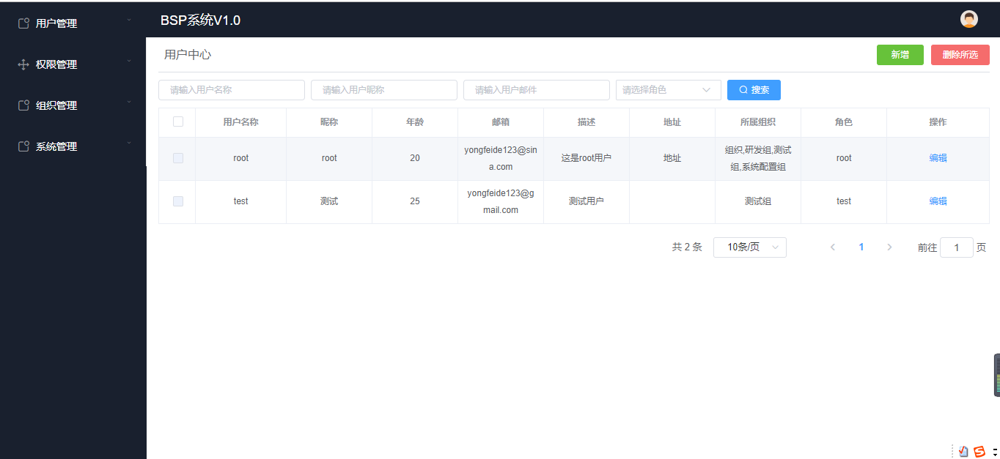
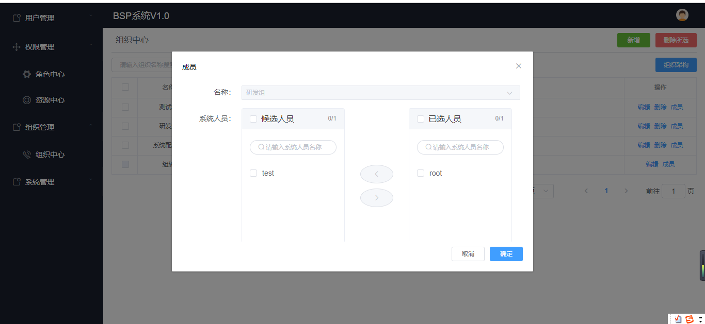

## 用戶组织权限管理系统
### 系统描述
#### 前端地址： [https://github.com/canyuegongzi/simple-user-center-web]()
**系统前端基于Vue +ElementUi + typeScript构建**
#### 后端地址： [https://github.com/canyuegongzi/simple-user-center]()
**系统后端基于node + nest.js +mysql构建**
### 系统结构

### 系统截图






### 目录说明
```
common                    // 公共（权限， 错误拦截）
config                    // 系统配置
controller                // 控制器
model                     // 控制器
    DTO                   // DTO数据约束
    entity                // entity定义
module                    // 系统模块
service                   // 服务（数据CRDU）
utils                     // 工具函数

```
### 系统运行
#### 前端
```
git clone https://github.com/canyuegongzi/simple-user-center-web.git
npm install
npm run serve
```
#### 后端
于congig/config.ts配置mysql redis 等全局配置
```
git clone https://github.com/canyuegongzi/simple-user-center.git
npm install
npm run start:dev
```
### 系统预览
[在线地址](http://canyuegongzi.xyz/simple-user-center-web)
#### **不要进行随意修改系统中的数据**
#### **不要进行随意修改系统中的数据**
#### **不要进行随意修改系统中的数据**
#### **不要进行随意修改系统中的数据**

